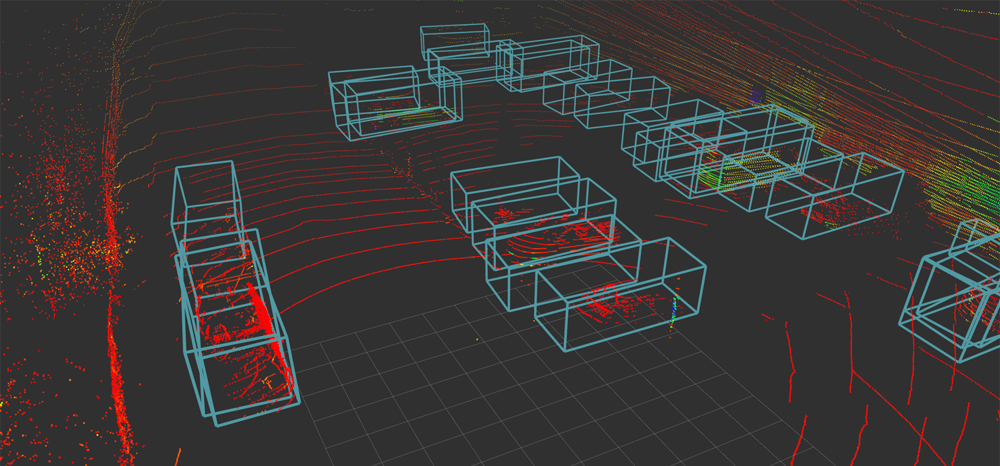

# point-pillars
A fast PointPillar-Multihead lidar detector



## Short guide
1. `$ make setup` to clone submodules
2. Download TensorRT-7.1 GA and place to repo root
3. `$ make docker-build`  
4. Obtain model files (download/train) and place to `config/`
5. `$ make docker-launch`  

ROS node and model should be running now. If not, then continue to more detailed guide.

## Installation
Setup the repository by calling `make setup`.
This downloads submodules to your computer, so docker build doesn't need to always clone them from remotes.

Then, download [TensorRT 7.1.3.4 GA](https://developer.nvidia.com/nvidia-tensorrt-7x-download) (Ubuntu 1804 CUDA 10.2) TAR package and place
it into the root of this repository, which allows docker to find it.
This must be done manually, because downloading requires personal nvidia account. File is placed to the repository root, so it exists inside the docker build context.

- Download pretrained [pytorch model](https://drive.google.com/file/d/1p-501mTWsq0G9RzroTWSXreIMyTUUpBM/view?usp=sharing)

- Download example [lidar data](https://drive.google.com/file/d/1KD0LT0kzcpGUysUu__dfnfYnHUW62iwN/view?usp=sharing)

- Check that hardcoded paths match to your model in `trans_pfe.py` & `trans_backbone_multihead.py` files. (Can be found from `OpenPCDet/tools/onnx_utils`).

- Create a development container and launch it: `make docker-build-dev` and `make docker-launch-dev`. You can use this container for debugging, development, training and generating ONNX and TRT models. 

- If the model was placed to correct location and previous paths match, then you should be able to generate ONNX model with `make generate-onnx`.

- If ONNX generation succeed, then you may generate TRT model with `make generate-trt`. If TRT model appears to config folder, then you are ready to do inference.

## Visualization
If you want to visualize detections, go to `src/rviz_detections` and build the visualizer image with build command given below. Then, you can launch a container that runs the visualizer node by using given make command in the repository root. 
```
$ docker build -t rviz-detections .
$ make docker-launch-viz
```
Now, if objects are detected, the visualizer node publishes a corresponding bounding box as a marker array, which can be visualized in Rviz.

(You can also visualize single static scheme without ROS.
Download and install `open3d` manually to your system and call `make visualize`).

## Repo structure
```
├── config
├── OpenPCDet
├── PointPillars
├── src
├── TensorRT-7.1.3.4.Ubuntu-18.04.x86_64-gnu.cuda-10.2.cudnn8.0.tar.gz
└── third_party
```

ROS code is inside `src/` and pointpillars detector library lies in `Pointpillars/` directory. `OpenPCDet` is needed for training and
generating the ONNX and TRT models. Inside `config/`, you should have configuration and the model files. Dependencies are hidden to `third_party` folder.

Note: it is better to duplicate `yaml` files to `config` directory and use these instead of modifying OpenPCDet configs. This way, we can easily mount config and use external files to adjust detector behaviour inside container online. Moreover, config changes do not then bust the docker build cache.

### Manual build
Project is picky about versions. In order to avoid replacing system libraries with older versions, dependencies has to be built from source and their location must be specified manually with environment/build variables.

Many dependencies are included as submodules, so you don't need to go through finding versions that happen to work togehter. First, build all dependencies. You may use existing make command to build these modules from source.

Set `TENSORRT_ROOT`, before building pointpillars. Variable can be set from terminal:
`export TENSORRT_ROOT=/path/to/TensorRT-7.1.3.4`. Then, build the pointpillars library.

Finally, build ROS detector with `catkin`. You can review `Dockerfile` for guidance.

### Dataset generation:

Download the nuScenes [dataset](https://www.nuscenes.org/) and mount the directory
including data to docker by adjusting makefile instruction.

Follow the OpenPCDet [guide](https://github.com/open-mmlab/OpenPCDet/blob/master/docs/GETTING_STARTED.md). It commands you to run:
`python3 -m pcdet.datasets.nuscenes.nuscenes_dataset --func create_nuscenes_infos --cfg_file tools/cfgs/dataset_configs/nuscenes_dataset.yaml --version v1.0-trainval`

This may take several hours to run if using whole dataset. After succesuful training data generation, following files should appear to your data directory:
```
nuscenes_dbinfos_10sweeps_withvelo.pkl
nuscenes_infos_10sweeps_train.pkl
nuscenes_infos_10sweeps_val.pkl
```

### Training & Testing

Create a symlink: `ln -s /app/OpenPCDet/data/ /app/data`  
Train: `python3 tools/train.py --cfg_file /app/config/cbgs_pp_multihead.yaml`  
Somethig like this should appear to terminal:
```
2021-10-30 20:04:17,060   INFO  CUDA_VISIBLE_DEVICES=ALL                                                                        [553/1816]2021-10-30 20:04:17,060   INFO  cfg_file         /app/config/cbgs_pp_multihead.yaml                                                       2021-10-30 20:04:17,060   INFO  batch_size       4                                                                                        2021-10-30 20:04:17,060   INFO  epochs           20                                                                                       2021-10-30 20:04:17,060   INFO  workers          8                                                                                        
...
cfg.CLASS_NAMES: ['car', 'truck', 'construction_vehicle', 'bus', 'trailer', 'barrier', 'motorcycle', 'bicycle', 'pedestrian', 'traffic_cone']
...
```
and then model starts training.

You can test model performance with command similar to this:
`python3 tools/test.py --cfg_file /app/config/cbgs_pp_multihead.yaml --ckpt output/app/config/cbgs_pp_multihead/default/ckpt/checkpoint_epoch_1.pth`

### Encountered issues

```
fatal error: NvInfer.h: No such file or directory
#include "NvInfer.h"
TensorRt TCheck that `TENSORRT_ROOT` is pointing to correct location.
```

```
box = eval_boxes.boxes[first_key][0]
IndexError: list index out of range

There is a problem when trying to evaluate multiple checkpoints:
https://github.com/open-mmlab/OpenPCDet/issues/456

Comment out whole evaluation function for multiple models in `test.py`.
Evaluate peformance manually and by providing the checkpoint file yourself.
```

```
TypeError: load() missing 1 required positional argument: 'Loader'
If you have `pyyaml 6.0`, this is not currectly compatible with dependencies.
Downgrade: `pip install pyyaml==5.4.1`
```

```
make generate-onnx complains about path.
Fix hard coded paths in trans_pfe.py & trans_backbone_multihead.py files.
```

```
No libnvinfer.so
Check that library exists in TensorRT-7.1.3.4/lib folder and previous path is
listed in LD_LIBRARY_PATH.
```

### System requirements
If you are planning to train a model, then following needs to be met:
- ~450GB storage
- 12GB RAM
- GPU

For what? GPU makes training and inference much faster. nuScenes dataset
takes roughly ~430GB space and you also need space for dependencies,
docker images and training checkpoints. Training data generation
requires quite a lot of RAM and this process gets killed
by system if you don't provide enough RAM memory.

### Tasks:
- Try to update CUDA 11
- Get rid of symlink step in training
- Update this readme and paths
- Fix evaluation script with multiple checkpoints

### References:
- https://github.com/hova88/PointPillars_MultiHead_40FPS
- https://github.com/open-mmlab/OpenPCDet
- https://github.com/onnx/onnx-tensorrt
- https://github.com/NVIDIA/TensorRT
- https://github.com/traveller59/spconv
